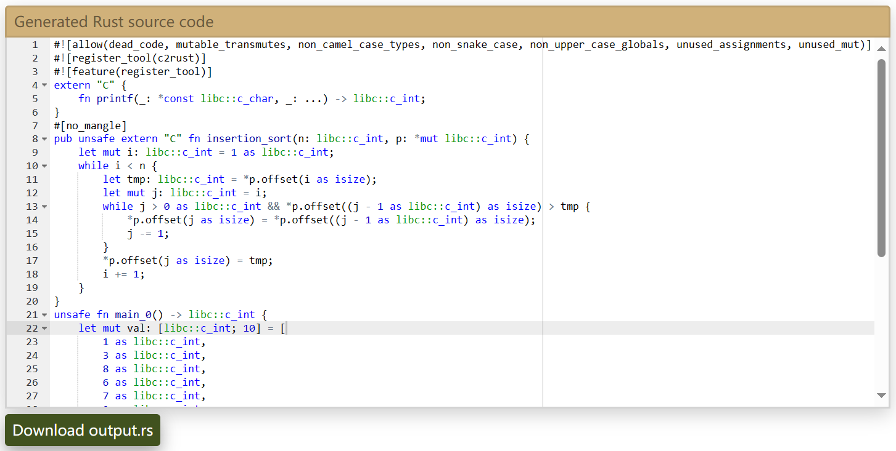
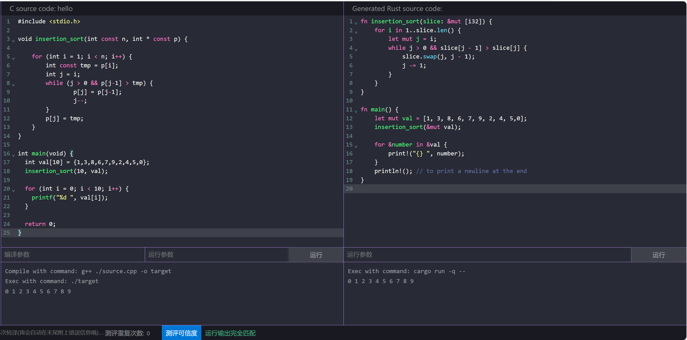
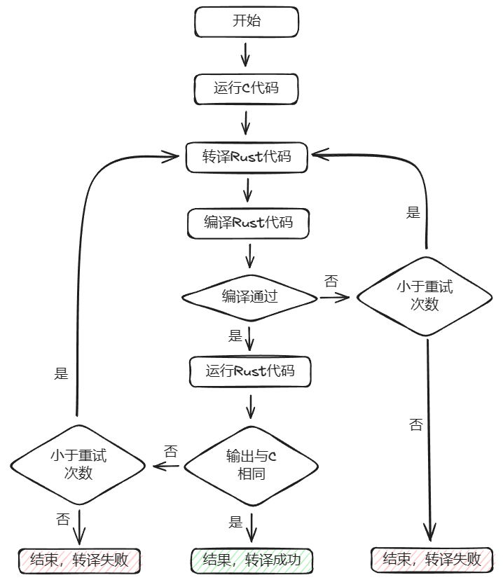

# 作品介绍

**C2Rust-Assistant** 是一款用于转译 C/C++ 到 Rust 的编程辅助工具。

作品地址：<https://atomgit.com/vivoblueos/000041-JianRuJiaJing>  

展示地址：<https://c2rust.cn/>

C2Rust-Assistant 采用 Web 的形式，提供 C/C++ 到 Rust 的转译服务。界面上有 **C 代码输入区**，**Rust 代码输出区**，内置了一些**测试用例**用来快速展示转译效果。工具自身可以**编译运行**原代码和转译后的代码，对于错误能将信息反馈进行**迭代转译**，追求转译后代码能编译、运行输出与C代码相同。

现阶段提供了**多种转译后端**可供选择，可以手动**输入提示信息**，以提高转译效果。并可以**设置重复次数**，限制在测评可信度是的迭代次数。

## 作品功能
* C/C++ 代码输入；
* Rust 转译代码展示；
* C/C++ 编译、运行，及运行结果展示；
* Rust 编译、运行，及运行结果展示；
* 作品提供多个内置示例代码，方便快速体验、验证；
* 作品提供多个转译工具以供选择，现阶段包括：
    1. [智谱AI](https://maas.aminer.cn/)
    2. [百川AI](https://www.baichuan-ai.com/)
    3. [immunant/c2rust](https://github.com/immunant/c2rust)

    其中智谱AI、百川AI为服务端API调用，immunant/c2rust 为本地部署应用。

    immunant/c2rust 是按经典编译原理进行转译，其它方式均为调用大模型能力进行转译。

* 重复转译，用户可以输出提示信息，并自动追加编译错误信息，反馈给模型进行迭代转译；
* 测评可信度，简单对比两边的输出，当输出不同时，根据设置的重复次数，自动进行迭代转译。


## 需求分析
C/C++ 是目前使用最广泛的编程语言，尤其是 C语言，因为其简单的语言、优异的性能，几乎是操作系统、嵌入式开发、驱动程序等对性能、资源有严格要求的场合下的首选开发语言。

C/C++ 又是古老的语言，当前已有巨大的代码存量，几乎渗透的所有行业，然而使用 C/C++ 编写的系统大约有 70% 的严重安全漏洞和内存使用不当情况。Rust 是一门能够构建可靠且高效软件的现代化语言，其丰富的类型系统和所有权模型保证了内存安全和线程安全，在编译期就能够消除各种各样的错误。用 Rust 代替 C/C++ 编写更安全的代码，已经成为行业趋势。

出于以下原因，需要一款 C/C++ 到 Rust 的转译工具：
1. 转译工程源码：Rust 要实现的功能，C/C++ 已有实现，希望最大化利用已有的 C/C++ 代码；
1. 转译功能代码：Rust 特有的丰富的类型系统和所有权模型，导致其学习成本巨大、学习曲线陡峭，程序员对于想要的功能，可以先用 C/C++ 实现，再通过转译工具快速得到 Rust 代码。

对于转译工具有以下要求：
1. 正确：转译后 Rust 代码可以运行，结果正确；
1. 效率：转译后 Rust 代码的不能有太大的性能丢失；
1. 辅助：因为转译后的 Rust 代码一定不会直接使用，只是为程序员提供方向明确的参考，所以要有一种方便使用的方式。

## 作品思路
对于代码转译，在很久之前只有一种解决方案：按编译原理，对原语言进行分析，再按目标语言进行点对点翻译。这种方式对于语法简单的语言可以使用，效果也会很好，例如多种脚本语言。但对 Rust 这种在设计上就极其复杂的语言，就会力不从心。C/C++ 会很容易得到分析结果，但对 Rust 的点对点翻译，会有巨大的工作量，短时间、少人力的情况下无法完成，且抛开性能，转译结果可能无法符合 Rust 的编程思想，简单的说就是不够优雅。

在如今 AI 大模型全面崛起的时代里，却又另一种解决方案：有许多用于代码生成、辅助编程的模型，完全可以借助这些模型的能力来实现代码转译。并且这是短时间内容易出成果的方式。

然而在实际使用过程中，发现有以下问题：
1. AI 不是每次都能生成相同的结果，而且对于一些代码，也无法做到正确的转译，转译结果需要人为修改；
2. 模型本身是有质量、性能差异的，选用不同的基座模型，天然得就会的到不同的转译结果；

对于以上问题，我们的解决思路是：
1. 首先对原代码进行编译、运行，得到目标结果；再对转译的代码用 rustc 进行编译，对于编译错误，将错误信息反馈给模型，进行反复迭代，争取得到能够通过编译的代码，然后将运行结果与目标结果进行比较，结果不同也反馈给模型进行迭代；
1. 如果经过较长时间无法得到正确输出，会将过程代码进行展示，同样可以起到辅助程序员转译的作用；
1. 前期调研多个模型，对模型进行初步筛选，在试用过后留下少量几个模型，作品中提供这几个模型的选择，程序员可以对结果进行综合比较。

> 其中最重要的是：如何让模型输出可以编译、运行结果正确的转译代码，目前的方案是将编译提示信息和结果对比信息反馈模型，实现自动化快速迭代。
>
> 行业内更优的方式是：通过 Word2Vec 工具、向量数据库、知识库、RAG等方式，在基座模型不变的情况，限制模型的输出范围，提高转译的命中率。

## 作品目标
从时间和难度方面考虑，对于初赛阶段的目标：
1. 能转换代码片段；
2. 能转换单个文件，对于完整的代码可以得到相同的输出；

> 因为作品有【测评可信度】的概念，目前阶段，简单的认为转译后代码能有与原代码相同的输出，所以要求原代码要是本身可以编译通过的代码，对于功能片段，可以编写成测试用例，使之成为可以编译的完整代码。

如果有幸通过初赛，我们的下一阶段目标是：

3. 能够转换多个文件组成的复杂项目；
4. 能直接转换一个复杂的 git 仓库；
5. 能对多个大模型转译结果进行输入、输出对比测试，给出更好结果；
6. 重构工具软件架构，能非常方便的集成更多大模型API，提供转译服务；

完成以上目标，C2Rust-Assistant 本身不管是从方向探索、实用价值，都是很用意义的一个作品，已经可以作为一个产品来初步使用，所以后期的目标是：

7. 能对某个知名开源 C 项目，给出完整转译结果，如 RTOS 中的 FreeRTOS、RT-Thread，工控协议中的 Modbus、DPN3.0等。

## 同类产品对比
<https://c2rust.com/>

项目地址：<https://github.com/immunant/c2rust>

这是一个开源的C到Rust转译工具项目，从内部代码中可以看出，这个工具的方案是编译原理的思路，先解析C代码，再翻译成Rust代码。

下面使用一个排序算法来对比两个工具，C 代码：
```c
#include <stdio.h>

void insertion_sort(int const n, int * const p) {
    for (int i = 1; i < n; i++) {
        int const tmp = p[i];
        int j = i;
        while (j > 0 && p[j-1] > tmp) {
            p[j] = p[j-1];
            j--;
        }
        p[j] = tmp;
    }
}

int main(void) {
    int val[10] = {1, 3, 8, 6, 7, 9, 2, 4, 5, 0};
    
    insertion_sort(10, val);

    for (int i = 0; i < 10; i++) {
        printf("%d ", val[i]);
    }

    return 0;
}

/**
 * 运行结果：
 * 0 1 2 3 4 5 6 7 8 9
 */

```



这是 **immunant/c2rust** 的输出结果，里面使用到了 Rust 提供的 C/C++ 混合编程的特性，比如 `extern "C"`，用 `unsafe` 包裹经过一对一严格翻译得到的Rust代码。并且出于作者的考虑，加入了 Rust 测试性功能 `#![register_tool(c2rust)]` 和在 `stable` 版本禁止使用的 `#![feature(register_tool)]`，去除这两行代码后，可以编译运行，结果与 C 语言输出结果相同。



这是**C2Rust-Assistant**的转译结果，可以看出转译的代码完全正确，可以编译、和原代码有相同的输出，代码质量也很高。

**immunant/c2rust** 的转译结果是严格符合 Rust 与 C/C++ 混合编程的特性，虽然结果正确，但其实代码本身可读性很差，也很不符合 Rust 的编程习惯。相对来讲，**C2Rust-Assistant**的转译结果更符合人类语言中的 **“信、雅、达”** 翻译标准。

## 测试说明

### 内置测例
作品为了方便展示，内置了一些测例，可以快速加载进行转译体验，测例主要有两种类型：**逻辑功能型**和**C语言特性型**。

除了赛事提供的测试用例，另外选取了常用算法的C实现:
* `hello` 字符串输出;
* `add` 加法;
* `word_number` 单词计数；
* `prime_number` 最大素数。

由于本人是一名 MCU 端的嵌入式软件工程师，产品中经常使用 RT-Thread，针对C语言在嵌入式操作系统中常用的特性，从 RT-Thread 内核中选取了部分代码片段，简单修改后作为测试用例：
* `list` 双向链表;
* `container_of` 获取结构体地址宏;
* `union` 联合体;
* `bit_fields` 位域;
* `func_ptr` 函数指针。

以下是这些测例的汇总说明：

| 序号 | 名称 | 类型 | 说明 |
| --- | --- | --- | --- |
| 1 | hello         | 逻辑功能 | 一次转译成功 |
| 2 | add           | 逻辑功能 | 一次转译成功 |
| 3 | trait         | C语言特性 | 一次转译成功 |
| 4 | weak_ptr      | C语言特性 | 一次转译成功 |
| 5 | macro         | C语言特性 | 多次转译成功 |
| 6 | args          | C语言特性 | 一次转译成功 |
| 7 | heap          | 逻辑功能 | 一次转译成功 |
| 8 | thread        | 逻辑功能 | 多次转译成功 |
| 9 | word_number   | 逻辑功能 | 一次转译成功 |
| 10 | prime_number | 逻辑功能 | 一次转译成功 |
| 11 | *list         | C语言特性 | 多次转译不成功 |
| 12 | *container_of | C语言特性 | 多次转译成功 |
| 13 | *union        | C语言特性 | 多次转译成功 |
| 14 | *bit_fields   | C语言特性 | 多次转译成功 |
| 15 | *func_ptr     | C语言特性 | 多次转译成功 |

`*` ：RT-Thread 内核中选取的测例。

> 具体内容可以查看[测例转译结果]()文件

从中可以看出，对于具有明确逻辑、功能的代码，AI 大模型可以很好的理解原代码，并作出正确转译；

而对于带有语言特性的代码，一般不能一次转译成功，需要人为的将编译错误信息、运行结果反馈给模型，进行多次转译，**因为转译成功的判据是与原代码有相同输出，简单且片面**，所以有些特性的转译不能很好的体现原代码中的C语言特性，出现了“知道结果凑过程”的现象，如 `container_of`、`bit_fields`等；

这些测例中难度最高的应该是 `list` 双向链表，在 rust 中实现链表本身属于高阶内容，多次转译后始终无法得到可以通过编译的代码。

## 代码说明

### 1. 流程图



其中，转译Rust代码根据选择的后端不一样：
* AI模型平台为：连接平台 - 发送请求 - 获取结果；
* immunant/c2rust 调用编译好的命令行工具，以`c2rust transpile ./build/compile_commands.json` 的格式转译，并获取结果。

### 2. 数据结构

1. 拓展 AI 模型平台
```js
// 用于流式返回数据
app.post('/api/transcode/stream', async (req, res) => {
    if (req.body.tool === 'chatglm') {
        await chatglm_stream(req.body, res);
    } else if (req.body.tool === 'baichuan') {
        await baichuan_stream(req.body, res);
    }
})
```
将与平台的交互抽象为请求内容`req`，和输出结果 `res`，为每个平台编写一个模块，并导出 `xxx_stream` 函数。

2. 拓展测例
```ts
interface CodeSample {
    name: string;
    kind: string;
    code: string;
}

const C_SAMPLE: CodeSample[]  = [
    // ...
]
```
定义 `CodeSample` 接口，包括 `name`、`kind`和`code`，其中 `king` 现阶段只有一个值 `sample`，为将来做拓展用，可以定义不同类型的测例，如果不需要通过编译的代码片段。

## 演示视频

[TODO:演示视频]

