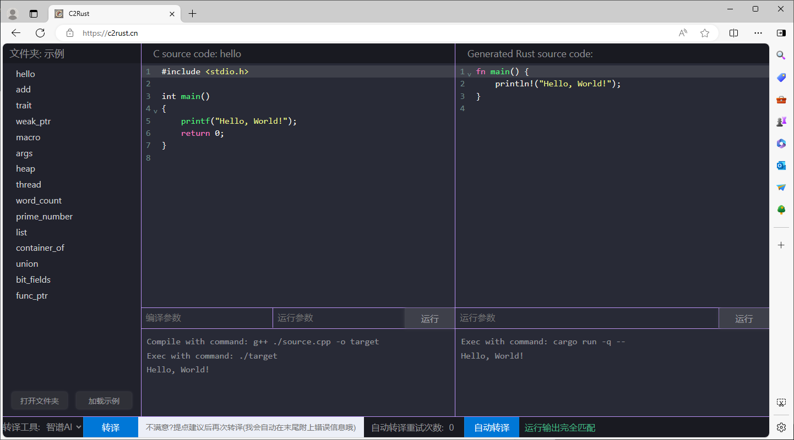

# 作品介绍

**[TODO:作品名称]** 是一款用于转译 C/C++ 到 Rust 的编程辅助工具。

作品地址：<https://atomgit.com/tanghongyu/> [TODO:新建代码仓库] 

展示地址：<https://c2rust.cn/>

[TODO:作品名称] 采用 Web 的形式，提供 C/C++ 到 Rust 的转译服务。

## 作品功能
* C/C++ 代码输入；
* Rust 转译代码展示；
* C/C++ 编译、运行，及运行结果展示；
* Rust 编译、运行，及运行结果展示；
* 作品提供多个内置示例代码，方便快速体验、验证；
* 作品提供多个转译工具以供选择，先阶段包括：[智谱AI平台](https://maas.aminer.cn/)、[immunant/c2rust](https://github.com/immunant/c2rust)（[TODO:待添加]、[百度千帆大模型平台](https://cloud.baidu.com/product/wenxinworkshop)、[HiBug-6B](https://github.com/HiBugEnterprise/HiBug-6B)）

    其中智谱AI、百度千帆大模型为服务端API调用，immunant/c2rust、HiBug-6B 为本地部署应用。

    immunant/c2rust 是按经典编译原理进行转译，其它方式均为调用大模型能力进行转译。

* 测评可信度，简单对比两边的输出
* 重复转译，用户可以输出提示信息，并自动追加编译错误信息，反馈给模型进行迭代转译

## 需求分析
C/C++ 是目前使用最广泛的编程语言，尤其是 C语言，因为其简单的语言、优异的性能，几乎是操作系统、嵌入式开发、驱动程序等对性能、资源有严格要求的场合下的首选开发语言。

C/C++ 又是古老的语言，当前已有巨大的代码存量，几乎渗透的所有行业，然而使用 C/C++ 编写的系统大约有 70% 的严重安全漏洞和内存使用不当情况。Rust 是一门能够构建可靠且高效软件的现代化语言，其丰富的类型系统和所有权模型保证了内存安全和线程安全，在编译期就能够消除各种各样的错误。用 Rust 代替 C/C++ 编写更安全的代码，已经成为行业趋势。

出于以下原因，需要一款 C/C++ 到 Rust 的转译工具：
1. 转译工程源码：Rust 要实现的功能，C/C++ 已有实现，希望最大化利用已有的 C/C++ 代码；
1. 转译功能代码：Rust 特有的丰富的类型系统和所有权模型，导致其学习成本巨大、学习曲线陡峭，程序员对于想要的功能，可以先用 C/C++ 实现，再通过转译工具快速得到 Rust 代码。

对于转译工具有以下要求：
1. 正确：转译后 Rust 代码可以运行，结果正确；
1. 效率：转译后 Rust 代码的不能有太大的性能丢失；
1. 辅助：因为转译后的 Rust 代码一定不会直接使用，只是为程序员提供方向明确的参考，所以要有一种方便使用的方式。

## 作品思路
对于代码转译，在很久之前只有一种解决方案：按编译原理，对原语言进行分析，再按目标语言进行点对点翻译。这种方式对于语法简单的语言可以使用，效果也会很好，但对 Rust 这种在设计上就极其复杂的语言，就会力不从心。C/C++ 会很容易得到分析结果，但对 Rust 的点对点翻译，会有巨大的工作量，短时间、少人力的情况下无法完成，且抛开性能，转译结果可能无法符合 Rust 的编程思想，简单的说就是不够优雅。

在如今 AI 大模型全面崛起的时代里，却又另一种解决方案：有许多用于代码生成、辅助编程的模型，完全可以借助这些模型的能力来实现代码转译。并且这是短时间内容易出成果的方式。

然而在实际使用过程中，发现有以下问题：
1. AI 不是每次都能生成相同的结果，而且对于一些代码，也无法做到正确的转译，转译结果需要人为修改；
2. 模型本身是有质量、性能差异的，选用不同的基座模型，天然得就会的到不同的转译结果；

对于以上问题，我们的解决思路是：
1. 首先对原代码进行编译、运行，得到目标结果；再对转译的代码用 rustc 进行编译，对于编译错误，将错误信息反馈给模型，进行反复迭代，争取得到能够通过编译的代码，然后将运行结果与目标结果进行比较，结果不同也反馈给模型进行迭代；
1. 如果经过较长时间无法得到正确输出，会将过程代码进行展示，同样可以起到辅助程序员转译的作用；
1. 前期调研多个模型，对模型进行初步筛选，在试用过后留下少量几个模型，作品中提供这几个模型的选择，程序员可以对结果进行综合比较。

> 其中最重要的是：如何让模型输出可以编译、运行结果正确的转译代码，目前的方案是将编译提示信息和结果对比信息反馈模型，实现自动化快速迭代。
>
> 行业内更优的方式是：[TODO:后期处理方式]

## 作品目标
从时间和难度方面考虑，对于初赛阶段的目标：
1. 能转换代码片段；
2. 能转换单个文件，对于完整的代码可以得到相同的输出；

如果有幸通过初赛，我们的下一阶段目标是：

3. 能够转换多个文件组成的复杂项目
4. 能直接转换一个复杂的 git 仓库；
5. 能对多个大模型转译结果进行输入、输出对比测试，给出更好结果；
6. 重构工具软件架构，能非常方便的集成更多大模型API，提供转译服务；

完成以上目标，[TODO:作品名称] 本身不管是从方向探索、实用价值，都是很用意义的一个作品，已经可以作为一个产品来初步使用，所以后期的目标是：

7. 能对某个知名开源 C 项目，给出完整转译结果，如 RTOS 中的 FreeRTOS、RT-Thread，工控协议中的 Modbus、DPN3.0等。

## 同类产品对比
<https://c2rust.com/>

## 测试说明

## 代码说明

### 1. 流程图

### 2. 数据结构

## 演示视频

