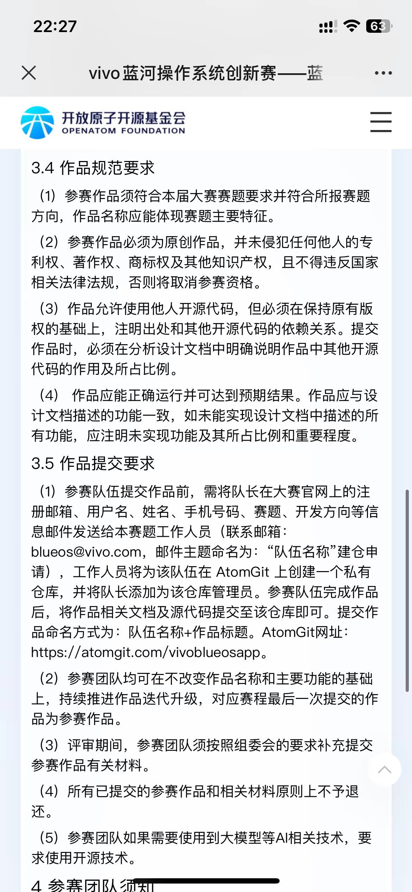
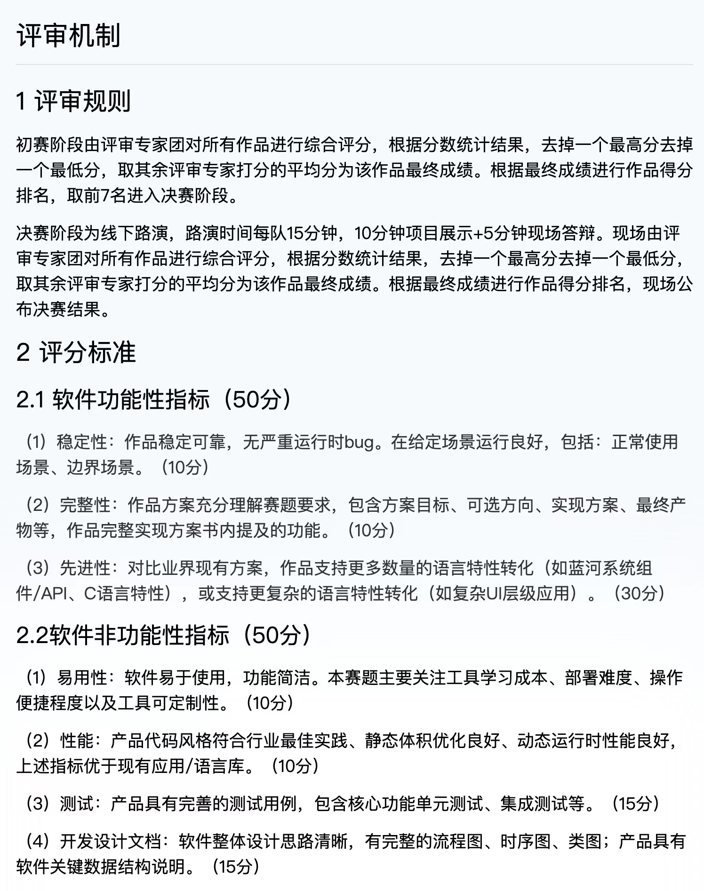
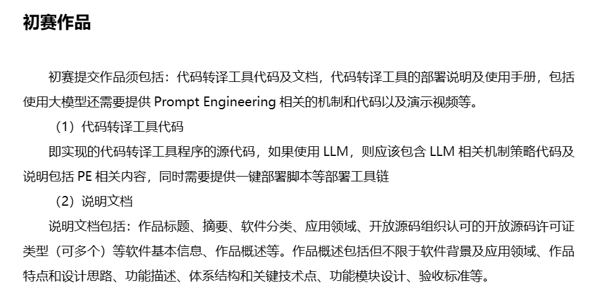

# 文档要求

提交要求：
1. 在 <https://atomgit.com/> 上有一个以仓库，
1. 仓库里有作品的源码、文档
1. 使用了大模型等AI技术，要求使用开源技术

文档要求：
1. 作品描述、方案目标、实现方案
1. 同类型现有方案的对比
1. 作品使用、部署方法
1. 作品里的测试说明（主要在代码中要有测试）
1. **软件整体设计思路**
1. **流程图、时序图、类图**
1. **关键数据结构说明**
1. **演示视频**
