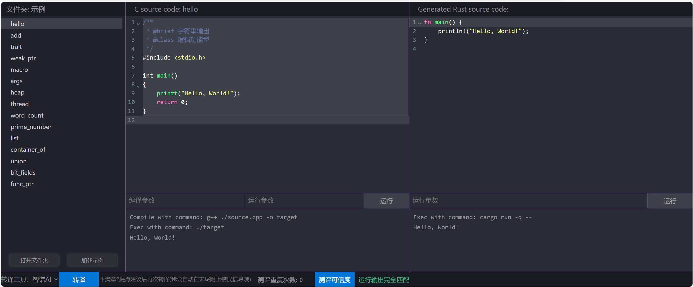

# 测例转译结果

共15个内置测例，其中：
* `hello` 是所有语言的第一段代码，作为转译的第一个测例，一次转移成功；
* `add`、`word_count`、`prime_number`，用C语言实现的算法，是逻辑功能型代码，一次转译成功；
* `heap`、`thread`，赛方提供的测例，是逻辑功能型代码，一次转译成功；
* `trait`、`weak_ptr`、`macro`、`args`，赛方提供的测例，是语言特性型代码，基本都需要至少2次转译；
* `heap`、`thread`，赛方提供的测例，是逻辑功能型代码，一次转译成功；
* `list`、`container_of`、`union`、`bit_fields`、`func_ptr`，都是从 RT-Thread 中提取的代码，是语言特性型代码，且都是用C语言编写操作系统是必用的语言特性，除了 `list` 无法转译，其余都需要多次转译。

## 1. hello



## 2. add


## 3. trait
内容过长，图片无法展示，以下是具体代码：
```c
/**
 * @brief C++的抽象与继承
 * @class 语言特性型
 */
#include <iostream>

class AbstractK
{
public:
    double r;
    double p;
    AbstractK(const double &r, const double &p) : r(r), p(p){};
    virtual const bool isInside() const = 0;
    virtual const bool overlap() const = 0;
};

class K2D : public AbstractK
{
public:
    K2D(const double &r, const double &p) : AbstractK(r, p){};
};

class K3D : public AbstractK
{
public:
    K3D(const double &r, const double &p) : AbstractK(r, p){};
};

class SquareK: public K2D
{
public:
    SquareK(const double &r, const double &p) : K2D(r, p){};
    const bool isInside() const override
    {
        std::cout << "SquareK::isInside()" << "\n";
        return false;
    }
    const bool overlap() const override
    {
        std::cout << "SquareK::overlap()" << "\n";
        return false;
    }
};

class CubeK: public K3D
{
public:
    CubeK(const double &r, const double &p) : K3D(r, p){};
    const bool isInside() const override
    {
        std::cout << "CubeK::isInside()" << "\n";
        return false;
    }
    const bool overlap() const override
    {
        std::cout << "CubeK::overlap()" << "\n";
        return false;
    }
};

int main(void) {
    SquareK *squark = new SquareK(1.0,2.0);
    CubeK *cubek = new CubeK(1.0,2.0);
    squark->isInside();
    squark->overlap();
    cubek->isInside();
    cubek->overlap();
}
```

Rust 转译结果：
```rust
trait AbstractK {
    fn is_inside(&self) -> bool;
    fn overlap(&self) -> bool;
}

struct K2D {
    r: f64,
    p: f64,
}

impl K2D {
    fn new(r: f64, p: f64) -> Self {
        K2D { r, p }
    }
}

struct K3D {
    r: f64,
    p: f64,
}

impl K3D {
    fn new(r: f64, p: f64) -> Self {
        K3D { r, p }
    }
}

struct SquareK {
    k2d: K2D,
}

impl SquareK {
    fn new(r: f64, p: f64) -> Self {
        SquareK { k2d: K2D::new(r, p) }
    }
}

impl AbstractK for SquareK {
    fn is_inside(&self) -> bool {
        println!("SquareK::isInside()");
        false
    }

    fn overlap(&self) -> bool {
        println!("SquareK::overlap()");
        false
    }
}

struct CubeK {
    k3d: K3D,
}

impl CubeK {
    fn new(r: f64, p: f64) -> Self {
        CubeK { k3d: K3D::new(r, p) }
    }
}

impl AbstractK for CubeK {
    fn is_inside(&self) -> bool {
        println!("CubeK::isInside()");
        false
    }

    fn overlap(&self) -> bool {
        println!("CubeK::overlap()");
        false
    }
}

fn main() {
    let squark = SquareK::new(1.0, 2.0);
    let cubek = CubeK::new(1.0, 2.0);

    squark.is_inside();
    squark.overlap();
    cubek.is_inside();
    cubek.overlap();
}
```

原代码有一定的复杂度，涉及到了抽象与继承，转译非一次完成，设置到重试次数，在经过两轮转译后得到相同输出，此时还剩余2次重试机会。


## 4. weak_ptr


## 5. macro


## 6. args


## 7. heap


这个测例考察的是面对C代码中的内存安全问题，如申请到的内存重复释放，Rust 转译代码需要处理掉这个问题。

事实也是如此，在C代码有错误、无法编译的情况，Rust 代码中处理了该问题，并得到了可以编译、运行的代码。

但代码质量还可以改进：
```rust
fn main() {
    let mut ptr = Box::new(0);

    *ptr = 10;

    println!("The value before free was: {}", *ptr);
    // 可以调用 `drop` 手动释放，也可以在退出作用域后让 Rust 自动释放
    //drop(ptr);
}
```

## 8. thread


## 9. word_count


## 10. prime_number


## 11. list
内容过长，图片无法展示，以下是具体代码：
```c
/**
 * @brief 双向链表。C语言没有链表类的数据类型，需要手动实现，这几乎是每个工程必须的组件，存在非常广泛，
 *        但用 Rust 实现链表其实是一个高难度操作，Rust 新手往往无法独立完成。
 * @class 语言特性型
 */
#include <stdio.h>

/**
 * Double List structure
 */
struct rt_list_node
{
    struct rt_list_node *next;                          /**< point to next node. */
    struct rt_list_node *prev;                          /**< point to prev node. */
};
typedef struct rt_list_node rt_list_t;                  /**< Type for lists. */

/**
 * @brief initialize a list
 *
 * @param l list to be initialized
 */
void rt_list_init(rt_list_t *l)
{
    l->next = l->prev = l;
}

/**
 * @brief insert a node after a list
 *
 * @param l list to insert it
 * @param n new node to be inserted
 */
void rt_list_insert_after(rt_list_t *l, rt_list_t *n)
{
    l->next->prev = n;
    n->next = l->next;

    l->next = n;
    n->prev = l;
}

/**
 * @brief insert a node before a list
 *
 * @param n new node to be inserted
 * @param l list to insert it
 */
    void rt_list_insert_before(rt_list_t *l, rt_list_t *n)
{
    l->prev->next = n;
    n->prev = l->prev;

    l->prev = n;
    n->next = l;
}

/**
 * @brief remove node from list.
 * @param n the node to remove from the list.
 */
    void rt_list_remove(rt_list_t *n)
{
    n->next->prev = n->prev;
    n->prev->next = n->next;

    n->next = n->prev = n;
}

/**
 * @brief tests whether a list is empty
 * @param l the list to test.
 */
    int rt_list_isempty(const rt_list_t *l)
{
    return l->next == l;
}

/**
 * @brief get the list length
 * @param l the list to get.
 */
    unsigned int rt_list_len(const rt_list_t *l)
{
    unsigned int len = 0;
    const rt_list_t *p = l;
    while (p->next != l)
    {
        p = p->next;
        len ++;
    }

    return len;
}

int main(void) {
    rt_list_t list = {0}, after = {0}, before = {0};
    const char *isempty[] = {"not empty", "is empty"};

    rt_list_init(&list);
    printf("%s\n", isempty[rt_list_isempty(&list)]);

    rt_list_insert_after(&list, &after);
    printf("%s\n", isempty[rt_list_isempty(&list)]);
    printf("%d\n", rt_list_len(&list));

    rt_list_insert_before(&list, &before);
    printf("%d\n", rt_list_len(&list));

    rt_list_remove(&after);
    printf("%d\n", rt_list_len(&list));

    rt_list_remove(&before);
    printf("%d\n", rt_list_len(&list));

    return 0;
}
```

Rust 转译结果：
```rust
use std::rc::{Rc, Weak};
use std::cell::RefCell;
use std::fmt;

type Node = Rc<RefCell<ListNode>>;

struct ListNode {
    next: Weak<RefCell<ListNode>>,
    prev: Weak<RefCell<ListNode>>,
}

impl ListNode {
    fn new() -> Node {
        Rc::new(RefCell::new(ListNode {
            next: Weak::new(),
            prev: Weak::new(),
        }))
    }

    fn init(&mut self) {
        self.next = Weak::new();
        self.prev = Weak::new();
    }

    fn insert_after(&mut self, new_node: Node) {
        if let Some(mut next) = self.next.upgrade() {
            new_node.borrow_mut().prev = Rc::downgrade(&self);
            next.borrow_mut().prev = Rc::downgrade(&new_node);
            self.next = Rc::downgrade(&new_node);
            new_node.borrow_mut().next = next;
        } else {
            // If self.next is None, we are the last node.
            // This makes us point to the new node, and it back to us.
            self.next = Rc::downgrade(&new_node);
            new_node.borrow_mut().prev = Rc::downgrade(self);
        }
    }

    fn insert_before(&mut self, new_node: Node) {
        if let Some(mut prev) = self.prev.upgrade() {
            new_node.borrow_mut().next = Rc::downgrade(self);
            prev.borrow_mut().next = Rc::downgrade(&new_node);
            self.prev = Rc::downgrade(&new_node);
            new_node.borrow_mut().prev = prev;
        } else {
            // If self.prev is None, we are the first node.
            // This makes us point back to the new node, and it to us.
            self.prev = Rc::downgrade(&new_node);
            new_node.borrow_mut().next = Rc::downgrade(self);
        }
    }

    fn remove(&mut self) {
        if let Some(mut next) = self.next.upgrade() {
            if let Some(mut prev) = self.prev.upgrade() {
                next.borrow_mut().prev = prev;
                prev.borrow_mut().next = next;
            }
            self.next = Weak::new();
            self.prev = Weak::new();
        }
    }

    fn is_empty(&self) -> bool {
        self.next.upgrade().is_none() && self.prev.upgrade().is_none()
    }

    fn len(&self) -> usize {
        let mut len = 0;
        let mut current = self.next.upgrade();
        while let Some(node) = current {
            len += 1;
            current = node.borrow().next.upgrade();
            if node.borrow()..upgrade() == Some(self.clone()) {
                break; // We've looped back to the start.
            }
        }
        len
    }
}

impl fmt::Debug for ListNode {
    fn fmt(&self, f: &mut fmt::Formatter) -> fmt::Result {
        write!(f, "ListNode .. }}")
    }
}

fn main() {
    let list = ListNode::new();
    let after = ListNode::new();
    let before = ListNode::new();

    list.borrow_mut().init();
    println!("{:?}", list.borrow().is_empty());

    list.borrow_mut().insert_after(after);
    println!("{:?}", list.borrow().is_empty());
    println!("{:?}", list.borrow().len());

    list.borrow_mut().insert_before(before);
    println!("{:?}", list.borrow().len());

    list.borrow_mut().remove();
    println!("{:?}", list.borrow().len());

    list.borrow_mut().remove();
    println!("{:?}", list.borrow().len());
}
```

这是 RT-Thread 内核源码中的双向链表，将以简单处理后形成一个链表测例。

因为代码中涉及指针操作，且涉及大量变量或值转移的情况，在 C 语言中可以自由操作，但在 Rust 中，由于其所有权概念，这些操作暴露出大量内存安全隐患。经过多轮转译后仍无法获取通过编译的代码。

## 12. container_of
```c
/**
 * @brief 如果在C代码中使用了面向对象编程的思想，就一定会有 `container_of` 宏，
 *        这个宏也是 linux 源码中的一段经典代码，
 *        这个宏用来根据已知的成员地址和结构体类型，计算出结构体的地址，原理上很简单，使用也非常广泛，
 *        但因为涉及指针、类型强制转换这些不安全操作，在rust中难以实现。
 * 
 *        如果用rust重写某个功能，根据 rust 的内置类型和语法，不会碰到这个问题，
 *        但如果转译已有的c代码，则必须用 rust 的方式实现这个宏。
 * @class 语言特性型
 */
#include <stdio.h>

#define rt_container_of(ptr, type, member) \
    ((type *)((char *)(ptr) - (unsigned long)(&((type *)0)->member)))

struct rt_node {
    int n;
} ;
/**
 * Base structure of Kernel object
 */
struct rt_object
{
    const char *name;                           /**< name of kernel object */
    int        type;                            /**< type of kernel object */
    int        flag;                            /**< flag of kernel object */

    struct rt_node  node;                       /**< list node of kernel object */
};

int main(void) {
    struct rt_object obj = {0}; 
    struct rt_node *ptr = &obj.node;

    obj.name = "tty1";
    obj.type = 1;
    obj.flag = 2;
    obj.node.n = 3;

    struct rt_object *container = rt_container_of(ptr, struct rt_object, node);
    printf("%s, %d, %d, %d\n", container->name, container->type, container->flag, container->node.n);

    return 0;

}
```


## 13. union


## 14. bit_fields


Rust 中没有位域的概念，这个测例只是考察转译工具面对位域时会如何操作。Rust 代码中，将对结构体内位域成员变量的读写操作转译成了结构体内的方法。

## 15. func_ptr
内容过长，图片无法展示，以下是具体代码：
```c
/**
 * @file 05func_ptr.c
 * @brief C代码中往往通过在结构体中定义函数指针的形式来实现面向对象编程的效果，Rust的trait可以更优雅的实现相同效果
 * 
 * @note 智谱AI 转译无法一次完成。因为涉及指针，几轮过后还是有错误，
 *       通过更换C代码的书写形式，可以转译两次得到正确输出。
 *       迭代过程见 `05func_ptr.md`
*/

#include <stdio.h>

typedef struct rt_device *rt_device_t;
/**
 * operations set for device object
 */
struct rt_device_ops
{
    /* common device interface */
    int  (*init)   (rt_device_t dev);
    int  (*open)   (rt_device_t dev, int oflag);
    int  (*close)  (rt_device_t dev);
    unsigned int (*read)   (rt_device_t dev, int pos, void *buffer, unsigned int size);
    unsigned int (*write)  (rt_device_t dev, int pos, const void *buffer, unsigned int size);
    int  (*control)(rt_device_t dev, int cmd, void *args);
};

struct rt_device {
    int flag;
    int open_flg;
    int ref_count;
    int device_id;
    // struct rt_device_ops ops;

    int  (*init)   (rt_device_t dev);
    int  (*open)   (rt_device_t dev, int oflag);
    int  (*close)  (rt_device_t dev);
    unsigned int (*read)   (rt_device_t dev, int pos, void *buffer, unsigned int size);
    unsigned int (*write)  (rt_device_t dev, int pos, const void *buffer, unsigned int size);
    int  (*control)(rt_device_t dev, int cmd, void *args);
};

int  init   (rt_device_t dev) {
    dev->flag = 0;
    printf("init\n");
    return 0;
}

int  open   (rt_device_t dev, int oflag) {
    dev->open_flg = oflag;
    printf("open, 0x%x\n", dev->open_flg);
    return 0;
}

int  close  (rt_device_t dev) {
    dev->open_flg = 0;
    printf("close\n");
    return 0;
}

unsigned int read   (rt_device_t dev, int pos, void *buffer, unsigned int size) {
    printf("read\n");
    return 0;
}

unsigned int write  (rt_device_t dev, int pos, const void *buffer, unsigned int size) {
    printf("write\n");
    return 0;
}

int  control(rt_device_t dev, int cmd, void *args) {
    printf("control\n");
    return 0;
}

int main(void) {
    struct rt_device dev = {0};
    dev.init = init;
    dev.open = open;
    dev.close = close;
    dev.read = read;
    dev.write = write;
    dev.control = control;

    dev.init(&dev);
    dev.open(&dev, 0x0102);
    dev.close(&dev);
    dev.read(&dev, 0, 0, 0);
    dev.write(&dev, 0, 0, 0);
    dev.control(&dev, 0, 0);

    return 0;
}
```

Rust 转译结果：
```rust
trait RtDeviceOps {
fn init(&mut self) -> i32;
fn open(&mut self, oflag: i32) -> i32;
fn close(&mut self) -> i32;
fn read(&mut self, pos: i32, buffer: &mut [u8]) -> usize;
fn write(&mut self, pos: i32, buffer: &[u8]) -> usize;
fn control(&mut self, cmd: i32, args: &mut [u8]) -> i32;
}

struct RtDevice {
flag: i32,
open_flg: i32,
ref_count: i32,
device_id: i32,
ops: Box<dyn RtDeviceOps>,
}

impl RtDevice {
fn new() -> Self {
    RtDevice {
        flag: 0,
        open_flg: 0,
        ref_count: 0,
        device_id: 0,
        ops: Box::new(RealRtDevice {}),
    }
}
}

struct RealRtDevice;

impl RtDeviceOps for RealRtDevice {
    fn init(&mut self) -> i32 {
        println!("init");
        0
    }

    fn open(&mut self, oflag: i32) -> i32 {
        println!("open, 0x{:x}", oflag);
        0
    }

    fn close(&mut self) -> i32 {
        println!("close");
        0
    }

    fn read(&mut self, _pos: i32, _buffer: &mut [u8]) -> usize {
        println!("read");
        0 // Replace with actual read logic.
    }

    fn write(&mut self, _pos: i32, _buffer: &[u8]) -> usize {
        println!("write");
        0 // Replace with actual write logic.
    }

    fn control(&mut self, _cmd: i32, _args: &mut [u8]) -> i32 {
        println!("control");
        0
    }
}

fn main() {
    let mut dev = RtDevice::new();
    dev.ops.init();
    dev.ops.open(0x0102);
    dev.ops.close();
    let mut buffer = [0u8; 1024]; // Example buffer, replace with actual usage.
    dev.ops.read(0, &mut buffer);
    dev.ops.write(0, &buffer);
    let mut args = [0u8; 1024]; // Example args buffer, replace with actual usage.
    dev.ops.control(0, &mut args);
}
```

可以看出，对于C语言中的函数指针，特别时结构内的函数指针成员，转译代码中很好的将它们转译成了 `trait`。如果可以进一步去除 `RtDevice::ops` 成员会时更好的结果。

另外，这个测例转换过程中有一个修改C代码过程，将函数指针直接定义在结构体内，而不是一个独立的结构体，大大提高了转译正确率。

---

这里详细记录以下这个测例的详细迭代流程：

第一次转译
```rust
struct RtDeviceOps {
    init: fn(&mut RtDevice) -> i32,
    open: fn(&mut RtDevice, i32) -> i32,
    close: fn(&mut RtDevice) -> i32,
    read: fn(&mut RtDevice, i32, *mut libc::c_void, u32) -> u32,
    write: fn(&mut RtDevice, i32, *const libc::c_void, u32) -> u32,
    control: fn(&mut RtDevice, i32, *mut libc::c_void) -> i32,
}

struct RtDevice {
    flag: i32,
    open_flg: i32,
    ref_count: i32,
    device_id: i32,
    ops: RtDeviceOps,
}

impl RtDevice {
    fn new() -> Self {
        RtDevice {
            flag: 0,
            open_flg: 0,
            ref_count: 0,
            device_id: 0,
            ops: RtDeviceOps {
                init: Self::init,
                open: Self::open,
                close: Self::close,
                read: Self::read,
                write: Self::write,
                control: Self::control,
            },
        }
    }

    fn init(dev: &mut RtDevice) -> i32 {
        dev.flag = 0;
        println!("init");
        0
    }

    fn open(dev: &mut RtDevice, oflag: i32) -> i32 {
        dev.open_flg = oflag;
        println!("open, 0x{:x}", dev.open_flg);
        0
    }

    fn close(dev: &mut RtDevice) -> i32 {
        dev.open_flg = 0;
        println!("close");
        0
    }

    fn read(dev: &mut RtDevice, pos: i32, buffer: *mut libc::c_void, size: u32) -> u32 {
        println!("read");
        0
    }

    fn write(dev: &mut RtDevice, pos: i32, buffer: *const libc::c_void, size: u32) -> u32 {
        println!("write");
        0
    }

    fn control(dev: &mut RtDevice, cmd: i32, args: *mut libc::c_void) -> i32 {
        println!("control");
        0
    }
}

fn main() {
    let mut dev = RtDevice::new();
    dev.ops.init(&mut dev);
    dev.ops.open(&mut dev, 0x0102);
    dev.ops.close(&mut dev);
    dev.ops.read(&mut dev, 0, std::ptr::null_mut(), 0);
    dev.ops.write(&mut dev, 0, std::ptr::null(), 0);
    dev.ops.control(&mut dev, 0, std::ptr::null_mut());
}
```

**经过多轮转译后仍得不到正确代码，尝试修改C代码：**
```c
struct rt_device {
    int flag;
    int open_flg;
    int ref_count;
    int device_id;
    // struct rt_device_ops ops; // 不使用结构体作为成员

    //改为将函数指针直接定义在结构体中
    int  (*init)   (rt_device_t dev);
    int  (*open)   (rt_device_t dev, int oflag);
    int  (*close)  (rt_device_t dev);
    unsigned int (*read)   (rt_device_t dev, int pos, void *buffer, unsigned int size);
    unsigned int (*write)  (rt_device_t dev, int pos, const void *buffer, unsigned int size);
    int  (*control)(rt_device_t dev, int cmd, void *args);
};
```

第一次输出结果编译错误，再次点击转译按钮，第二次输出结果通过编译，输出也一致
```rust
trait RtDeviceOps {
    fn init(&mut self) -> i32;
    fn open(&mut self, oflag: i32) -> i32;
    fn close(&mut self) -> i32;
    fn read(&mut self, pos: i32, buffer: &mut [u8]) -> usize;
    fn write(&mut self, pos: i32, buffer: &[u8]) -> usize;
    fn control(&mut self, cmd: i32, args: &mut [u8]) -> i32;
}

struct RtDevice {
    flag: i32,
    open_flg: i32,
    ref_count: i32,
    device_id: i32,
    ops: Box<dyn RtDeviceOps>,
}

impl RtDevice {
    fn new() -> Self {
        RtDevice {
            flag: 0,
            open_flg: 0,
            ref_count: 0,
            device_id: 0,
            ops: Box::new(RealRtDevice {}),
        }
    }
}

struct RealRtDevice;

impl RtDeviceOps for RealRtDevice {
    fn init(&mut self) -> i32 {
        println!("init");
        0
    }

    fn open(&mut self, oflag: i32) -> i32 {
        println!("open, 0x{:x}", oflag);
        0
    }

    fn close(&mut self) -> i32 {
        println!("close");
        0
    }

    fn read(&mut self, _pos: i32, _buffer: &mut [u8]) -> usize {
        println!("read");
        0 // Replace with actual read logic.
    }

    fn write(&mut self, _pos: i32, _buffer: &[u8]) -> usize {
        println!("write");
        0 // Replace with actual write logic.
    }

    fn control(&mut self, _cmd: i32, _args: &mut [u8]) -> i32 {
        println!("control");
        0
    }
}

fn main() {
    let mut dev = RtDevice::new();
    dev.ops.init();
    dev.ops.open(0x0102);
    dev.ops.close();
    let mut buffer = [0u8; 1024]; // Example buffer, replace with actual usage.
    dev.ops.read(0, &mut buffer);
    dev.ops.write(0, &buffer);
    let mut args = [0u8; 1024]; // Example args buffer, replace with actual usage.
    dev.ops.control(0, &mut args);
}
```

---